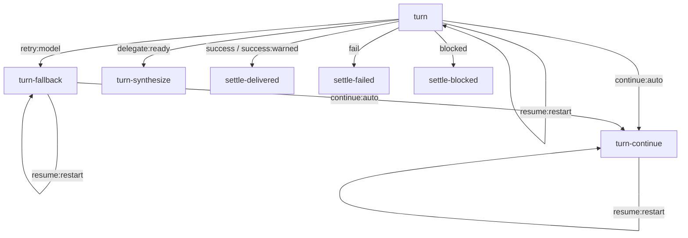

# ADR-002: Chat turns on the workflow graph

**Status:** Proposed (Phase A draft — awaiting owner approval before any implementation)
**Date:** 2026-08-01
**Package:** `@theia/qaap-cloud-workspace`
**Builds on:** ADR-001 (Dynamic Workflows)

## Context

Two lifecycle systems coexist today:

1. **The workflow graph (ADR-001).** IR with conditional edges (`qaap-workflow-ir.ts`), a pure
   run reducer (`qaap-workflow-run.ts`), a durable owner-scoped run store
   (`qaap-workflow-run-store.ts`), and a dispatcher over runtime ports
   (`qaap-workflow-dispatcher.ts`, `qaap-workflow-runtime-ports.ts`).
2. **The imperative conversation store** governing Work Hub chat
   (`qaap-agent-conversation-store.ts` + `qaap-agent-task-runner.ts`): ad-hoc transition methods
   (`maybeAutoContinueIncompleteTurn`, `maybeRetryTurnWithFallbackModel`,
   `maybeAutoResumeInterruptedTurn`, `interruptStreamingTurnForRestart`,
   `sweepZombieStreamingTurns`) over a flat conversation status enum, plus mailbox-based team
   delegation.

Goal: express the chat-turn lifecycle — spawn → stream → settle/fail/interrupt →
auto-continue / model-fallback / restart-resume / delegation — as nodes and conditional edges of
the workflow IR, with real checkpointing, so that restart recovery is a graph transition instead
of imperative reconstruction from JSON.

### Corrections to the framing (what the code actually says)

Three assumptions in the task framing do not survive contact with the code. Recording them here so
the decision rests on the real system:

1. **ADR-001 is not "mostly inert."** `QaapWorkflowService` is a bound
   `BackendApplicationContribution`: it subscribes to `onDidChangeTask` / `onDidChangeJob`, runs
   `reconcileOnBoot()` on start and `sweepDeadlines()` on a 60 s timer
   (`qaap-workflow-service.ts`), and the ports are implemented against both runtimes with
   capability/tier routing, backend-health cooldown and judge independence
   (`qaap-workflow-runtime-ports.ts`). What is true: **no chat turn passes through it** — runs are
   born only via the HTTP template API. ADR-002 does not build an engine; it connects the chat to
   the engine that exists. (Genuinely inert: the `router` kind — actively **rejected** by
   `validateQaapWorkflowDef` (`qaap-workflow-ir.ts:269`) — and the `shell` / `parse-sentinel`
   deterministic ops.)
2. **Run durability is not delegated to the Job Runtime.** There are three operating durability
   layers: the run store persists graph position atomically **before** resolving any mutation
   (`mutate()`: apply → `writeJsonAtomic` → publish, `qaap-workflow-run-store.ts:436`); the task
   runner persists agent tasks and re-marks lost processes `interrupted` on restore
   (`qaap-agent-task-runner.ts:717`); the job runtime persists deterministic jobs with durable
   retry/backoff. ADR-001's "durability comes from the job runtime" applies to *deterministic
   nodes only*. ADR-002 adds **no fourth layer**.
3. **The imperative turn state is not the 4-value enum.** `QaapAgentConversationStatus` is a
   per-conversation projection (`'settled'` is never even assigned by the backend). The real turn
   machine is implicit in per-message fields (`taskId`, `autoContinueRootMessageId`,
   `restartResumeCount`, `runUserMessageId`, `runActive`, `error`) **plus five non-durable
   in-memory maps** (`taskToConversation`, `modelFallbackTriedByUserMessage`,
   `loopSpawnCountByUserMessage`, `pendingTeamSynthesisForLeader`, `subtaskMailboxDelivered` —
   store:273-287). After a restart, the fallback tried-set and the shared 4-spawn ceiling reset
   today. **This is the strongest argument for the migration: the graph makes durable what is
   currently process memory.**

## Decision

### D1. Cardinality: one run per human root turn

A workflow run corresponds to **one human-authored user message** (the root), not to a
conversation and not to a single spawn. The root is the anchor the imperative budgets already
share: `resolveLoopBudgetKey` collapses every generated continuation to the human root
(store:2071), `countAutoContinueAttempts` counts messages carrying `autoContinueRootMessageId`
(store:2077), and `restartResumeCount` lives on the root message (store:3425).

- Auto-continue, model fallback and restart-resume are **node re-visits inside the same run** —
  not new runs. The synthetic `[keep going]` user message remains in the transcript as an *effect*
  of the dispatch, not as a new root.
- A conversation maps to a *sequence* of runs (plus up to `MAX_CONCURRENT_CONVERSATION_RUNS`
  live peers). Conversation status stays what it already is in practice: a projection
  (`settleStatusForRun` already derives `streaming` from live peer runs).
- Rejected: run-per-conversation (collides with `maxNodeRuns`, `MAX_RUNS_PER_OWNER`, rewind, and
  multitasking peers); run-per-spawn (destroys the budget accounting unit pinned by
  `qaap-agent-conversation-store-spawn-budget.spec.ts`).

**Control plane vs data plane.** The run store becomes the only authority on lifecycle
*transitions* (which node runs next, with which persisted counter). The conversation store remains
the *data plane*: transcript, SSE frames, streaming deltas (500 ms debounce), git checkpoints, and
denormalized projection fields. Streaming output never touches the run index.

### D2. The canonical turn graph (`qaap.chat-turn@1`)

Rich outcomes, no gate nodes. The alternative — deterministic "gate" nodes (`continue-gate`,
`fallback-gate`, `resume-gate`) dispatched as jobs — was rejected: each gate would cost a job-lane
occupation plus two full index writes to evaluate a pure function over data the adapter already
holds, and a single self-looping `turn` node cannot reproduce the three heterogeneous product
ceilings with one `visits` counter. Separate nodes per retry *kind* give per-kind persisted
counters for free.

**IR additions (all additive):**

- `QaapWorkflowNodeOutcome` / `QaapWorkflowEdgeWhen` gain `'resume:restart'`, `'retry:model'`,
  `'continue:auto'`, `'success:warned'` (platform piece) and `'delegate:ready'` (delegation piece).
- **Degradation table** in `stepQaapWorkflow`: when a node's outgoing edges declare *no* edge for
  a rich outcome, matching retries with its base outcome —
  `resume:restart→fail`, `retry:model→fail`, `continue:auto→success`, `success:warned→fail`,
  `delegate:ready→success`. Existing templates and their pinned specs (review conformance,
  dispatcher, run reducer) see no behavior change; `resolveAgentTurnOutcome` itself is untouched
  (it keeps mapping `completed_with_warnings → 'fail'` for ADR-001 templates — reusing it for chat
  would have been a regression, because the chat treats `completed_with_warnings` as a *delivered*
  turn with no auto-continue, store:2042).
- A new pure resolver `resolveChatTurnOutcome()` (common layer, beside `resolveAgentTurnOutcome`)
  composes the existing classifiers — `agentTurnHasRetryableEmptyOutput/ModelFailure/
  ToolSupportFailure`, `resolveNextFallbackAgentModel`, `isIncompleteAgentTurn`,
  `autoContinueAllowedForInteraction`, `resolveCompletedTurnAuthFailureReason` — **and the product
  ceilings**, reading persisted `run.visits` / trace. When a ceiling is exhausted the resolver
  *degrades the outcome* (e.g. incomplete-but-out-of-continues → `success`), because exhausting
  auto-continue today does not fail the turn. Quota/rate-limit failures are never retried, as
  today (store:2099).

**Nodes** (`agent-turn` nodes carry pinned `agentRef`, `isolation: 'cwd'`, and are spawned with
`externalReview: false` so the runner's internal verification/review loop stays where it is):

| Node | Kind | Purpose |
|---|---|---|
| `turn` | agent-turn | Initial CLI spawn with the transcript-built prompt |
| `turn-fallback` | agent-turn | Re-spawn with the next curated model (tried-set persisted as run artifact `fallback.tried`) |
| `turn-continue` | agent-turn | Re-spawn with `buildAgentAutoContinuePrompt`; the port posts the synthetic user message for transcript parity |
| `turn-synthesize` | agent-turn | Team-synthesis turn after delegation settles (delegation piece) |
| `settle-delivered` | emit `turn.delivered` | Projection → `idle` (+ verification-warning trace on `success:warned`) |
| `settle-failed` | emit `turn.failed` | Projection → `failed` (auth/quota/watchdog/exhausted-resume reasons) |
| `settle-blocked` | emit `turn.blocked` | Projection → `markTaskBlocked` + blocked trace |

`settle-blocked` is an **emit, not a human-gate**: today a blocked turn *ends* (store:2036-2041)
and the next human input starts a new turn. Parking the run `awaiting-human` would change the
observable contract; human-gates stay available for future flows.

**Edges** (`T` = each of `turn | turn-fallback | turn-continue | turn-synthesize`):

(The `success | success:warned | fail | blocked` and `resume:restart` edges repeat from every `T`
node; omitted above for legibility. `turn-synthesize` has no outgoing `delegate:ready`.)

**Budgets.** Product ceilings live in the resolver/reconciler over persisted state:
auto-continues < 2 (`visits['turn-continue']`), shared re-spawn ceiling ≤ 4
(`nodeRuns` across T nodes — this ceiling is in-memory-only today and becomes durable),
resumes ≤ `MAX_RESTART_RESUMES` (count of `resume:restart` trace entries). The run budget is a
backstop that must never bite first: `{ maxNodeRuns: 12, maxVisitsPerNode: 4,
maxNodeMs: QAAP_MAX_TURN_MINUTES, maxRunMs: default }`. `restartResumeCount` is projected onto the
root message as `count(trace, 'resume:restart')` so existing specs and UI read identical values.

### D3. Checkpointing: reuse the run store; no new checkpointer

The auto-resume fix's key rule — *resumable state reaches disk BEFORE the process spawns, with a
bounded persisted retry counter* (store:3446-3452, an artisanal `await this.persist()`) — is
already the **structural invariant** of the graph side: `report()` increments `visits`, appends
trace, and persists inside `mutate()` before resolving; only then does the dispatcher spawn the
next node. The OOM loop (restart→resume→OOM) is bounded by construction: the incremented visit is
on disk before the child exists, across all restarts.

- **No `function`-job wrapper for turns.** Reaffirmed from ADR-001 ("Resolved"): wrapping a turn
  in a job stacks two queues (job lanes/leases over the runner FIFO) and deadlocks under fan-out.
  Agent turns stay on `QaapAgentTaskRunner`; deterministic nodes stay on the job runtime.
- **Boot-window fix (platform piece, benefits existing workflows).** Today `dispatch()` calls
  `startAgentTurn()` and only then `attachDispatch()` (dispatcher:134-137). A crash between the
  two leaves a node in `run.active` with no `dispatched` entry: `reconcileOnBoot` only
  self-settles bookkeeping kinds, and `findTimedOutQaapWorkflowNodes` requires a `dispatchedAt`
  (run.ts:110) — the run hangs until `maxRunMs` (4 h). Fix: **reconciliation treats any
  dispatchable node active without a `dispatched` entry as interrupted** (→ resume or fail edge).
  A durable pre-spawn "dispatch intent" record was considered and rejected: it costs one full
  index rewrite per dispatch and still cannot identify the orphan process (it has no externalId
  yet). Known residual (pre-existing, unchanged): in dev-local restarts where children outlive the
  backend, a re-dispatch after this window can briefly leave an orphan CLI writing the cwd; on the
  VPS the cgroup kills children with the backend.
- **Persistence table** (event → write → ordering):

| Event | Run store (control) | Conversation store (data) | Ordering |
|---|---|---|---|
| User posts root turn | `start()`: run running, `visits.turn=1` → **disk** | user message, `status:'streaming'`, `workflowRunId` stamp | conv first (UX row), run persisted **before spawn** ← pre-spawn point |
| Node dispatched | `attachDispatch(taskId)` → disk | task created *through* the store (transcript prompt, provenance) | spawn → attach (window covered by boot fix) |
| Streaming output | **nothing** (zero extra I/O) | 500 ms debounced transcript persist | — |
| Task terminal | `report(outcome)`: visits/trace/artifact → disk | finalize agent message, clear `runActive` | **report persists before any re-spawn** |
| Boot, live node lost | reconciler: `report('resume:restart')` → disk, then dispatch | project `restartResumeCount`; spawn failure degrades to interrupted-with-retry-hint | pre-spawn, structural |
| Node/run wall clock | `report('fail', timeout detail)` **before** cancel (dispatcher:267) / `expire()` | watchdog message + failed trace | report → cancel |
| Settle (emit) | run terminal → disk | `idle`/`failed`/blocked projection persists | run first, projection second |

### D4. The chat-turn port: spawn through the store, settle through the graph

A new `QaapChatTurnPort` implements `QaapWorkflowAgentTurnPort` for `chat-turn` runs by calling
**into the conversation store** (reusing `buildTaskCreateRequest`, `taskToConversation`, orphan
agent-message cleanup, provenance stamping) rather than the runner directly — the agent message,
streaming and SSE keep being born where they are born today.

Subscriber-race rule: `onDidChangeTask` currently feeds both the store (`onTaskChanged`) and the
workflow service. For graph-governed turns, the store's subscriber handles **streaming/output
only**; terminal settle and re-spawn are ordered by the graph through explicit adapter methods
(`applyTurnSettled` / `applyTurnRespawn`). One decider, one materializer — never two writers for
the same terminal event.

### D5. Router: still not needed

The chat never picks a backend by graph policy: `turnAgentId` is fixed by the user/conversation at
`postUserMessage`, so the node pins `agentRef`. Fallback-model selection is not a topology
decision (it always re-enters `turn-fallback`); it is dispatch state — `resolveNextFallbackAgentModel`
over the persisted tried-set artifact, applied by the port. The `router` kind stays rejected by
validation (`qaap-workflow-ir.ts:269`) with `SELF_SETTLED.router='fail'` as the airbag; physically
removing the kind from the union is listed as conscious debt.

### D6. Coexistence and incremental migration

Flag `QAAP_TURN_GRAPH` (env, default off) decides whether **new / adopted** turns are
graph-governed; the durable per-turn stamp `workflowRunId` on the root user message decides who
governs an **existing** turn. Every `maybeX` method and the store sweep consult one predicate
(`turnGovernedByGraph`). No shadow mode: validation comes from conformance specs and dual-mode
spec runs, not from mirror runs in production.

**Pieces (one commit each, bisectable):**

0. **Platform (no observable change).** New outcomes + degradation table + `chat-turn@1` def +
   `resolveChatTurnOutcome` + the boot-window reconciliation fix. (`QaapChatTurnPort` materializes
   with its first dispatcher consumer in piece 2 — no dead skeleton before that.)
   Conformance spec (pattern proven by `qaap-workflow-review-conformance.spec.ts`): a case matrix
   {task state × failure class × budgets × interaction guard} asserting the graph's terminal
   equals the imperative decision. All existing workflow specs pass untouched.
1. **Auto-resume by adoption — the paradigm proof.** With the flag on, `restoreFromDisk` no longer
   calls `maybeAutoResumeInterruptedTurn`; instead each orphaned `streaming` turn is **adopted**
   into a pre-seeded `chat-turn` run (active `['turn']`, `dispatched['turn']` = the dead taskId,
   `visits`/trace seeded from the projected `restartResumeCount`) and standard `reconcileOnBoot`
   does the rest: dead task → reconciler checks the interaction guard + resume ceiling →
   `report('resume:restart')` (persisted) → re-spawn via the port → `attachDispatch`; ceiling
   exhausted or guard vetoed → `fail` edge → `settle-failed` with today's "Retry to continue"
   projection; spawn failure → same degradation. The resumed task's *terminal* is then also graph-
   settled (`success/fail/blocked → settle-*`), with follow-up decisions (auto-continue, fallback)
   **delegated back to the imperative methods from the projection hook** — those transitions remain
   wholly imperative until their own pieces. The migrated transition (resume) is wholly graph.
   Because a post-settle imperative fallback re-spawn leaves the finished run behind, a later
   restart re-adopts the turn into a *new* run seeded from the projected counter — the projection
   is the carry, which is why it is not cosmetic.
   Boot order: the workflow service awaits the conversation store's `restoreReady`; the imperative
   sweep keeps its existing live-task guard, and governed turns are **exempt from
   `sweepZombieStreamingTurns`** from this piece on (a turn cannot have two executioners);
   `sweepDeadlines` covers them via `maxNodeMs`, extended with the REL-5 pending-approval pardon
   (adapter exposes `turnHasPendingApproval` before a timeout report).
   **Equivalence: the five contracts of `qaap-agent-conversation-store-restart-resume.spec.ts`
   pass unedited** (dual-mode describe), reading identical observables: runner-create calls,
   projected `restartResumeCount`, interaction-guard veto, pre-spawn persistence with degradation,
   sweep-does-not-reinterrupt.
2. **Model fallback** → `retry:model` edge + `turn-fallback`; tried-set becomes a run artifact
   (durability across restarts — a hardening, today it resets). Equivalence:
   `qaap-agent-model-fallback.spec.ts` untouched (pure helpers), store fallback/auth-failure/
   run-pairing specs dual-mode, quota exclusion preserved.
3. **Auto-continue** → `continue:auto` + `turn-continue`, synthetic message posted by the port.
   Equivalence: `spawn-budget.spec.ts` (#12 shared ceiling, now durable), `completed_with_warnings`
   and blocked cases (never continue over a question to the user).
4. **Watchdog consolidation.** Retire the imperative sweep for governed turns entirely;
   `sweepDeadlines` + `maxNodeMs` is the only clock. Equivalence:
   `qaap-agent-conversation-store-watchdog.spec.ts` dual-mode + an anti-double-kill spec
   (exactly one cancel, one failed message).
5. **Delegation** — last, via **deferred outcome**: the adapter withholds the leader node's
   terminal report until `areAllSubtasksSettled` (`qaap-team-mailbox.ts:107`), then reports
   `delegate:ready → turn-synthesize`. The mailbox keeps delivering transcript messages
   imperatively. This gains restart-durability for pending synthesis (today
   `pendingTeamSynthesisForLeader` is memory) because boot reconciliation re-derives settlement
   from the persisted task index. No IR change (the static-join limitation is respected).
   Fallback plan if wall-clock semantics get awkward: child-runs linked by `parentRunId`.
6. **Flip the default on**, keep the flag as kill-switch for one release, then prune the
   imperative branches (`maybeAutoResumeInterruptedTurn` et al. become thin projections).

### D7. Risks and how they are tested

1. **Double governance** (graph + legacy `maybeX` both act on one turn → double spawn).
   Single predicate + exclusion spec: flag on, simulated terminal, assert exactly one
   `taskRunner.create`.
2. **Subscriber race** on `onDidChangeTask` (store vs workflow service). D4 rule; spec with a
   synchronous emitter asserting settle ordering.
3. **Index divergence** (two JSON stores with independent mutation chains). Precedence rule: the
   run store owns lifecycle truth; the conversation projection is re-derivable at boot.
   Crash-injection spec: kill between `report` persist and projection persist, assert convergence
   after restore.
4. **Reintroducing the OOM loop through the graph.** Covered by the structural pre-spawn invariant
   + the boot-window fix; spec mirrors "persists the counter BEFORE spawning" with a hard-kill
   simulation between report and spawn.
5. **Watchdog double-kill / divergent messages.** Exemption from piece 1, consolidation in
   piece 4; REL-5 pardon replicated before timeout reports. Spec: expired governed turn produces
   exactly one cancel and today's watchdog copy.
6. **UX/transcript regression** (SSE frames, `runUserMessageId` pairing, orphan-message cleanup,
   model badges). Mitigation: the port reuses the store's existing seams; `run-pairing`,
   `parallel-runs`, `auth-failure` specs run dual-mode.

## Consequences

- Restart recovery becomes `reconcileOnBoot` + a `resume:restart` edge — one code path for chat
  turns and template workflows, replacing bespoke reconstruction.
- The fallback tried-set, the shared spawn ceiling and pending team synthesis become durable
  (they are process memory today).
- The turn's full history is auditable in the run trace (`why did this end like this?` gets the
  same answer chat and workflows).
- The conversation store shrinks toward transcript + projection; its five in-memory lifecycle maps
  disappear with piece 6.
- New turn policies (different retry ladders, review gates on chat) become template edits, not new
  store methods.

## Non-goals

- Absorbing the runner's internal verification/adversarial review into the chat graph
  (`externalReview` stays false for chat turns; unification is ADR-001 "Next #2").
- Streaming/transcript data in the run store (every `mutate()` rewrites the index; the debounced
  conversation store is the right home for the firehose).
- Parallel-run worktree variants, human-gate for blocked turns, dynamic fan-out IR for delegation
  (deferred-outcome covers it), NL→IR compilation.
- Physically deleting the `router` kind and `MAX_LOOP_SPAWNS_PER_USER_MESSAGE` before piece 6.

## Known limits

- The degradation table makes rich outcomes safe for old defs, but composite edge predicates are
  still not expressible (unchanged ADR-001 limit).
- Piece 1's adoption seeds a run mid-life; its trace before adoption is synthetic (seeded resume
  entries), so pre-adoption history detail is the projection's, not the graph's.
- The dev-local orphan-CLI window after a crash between spawn and attach persists (pre-existing;
  cgroup-covered on the VPS).
- `maxNodeMs` has no native pause notion; the pending-approval pardon lives in the adapter until a
  need for graph-level pauses appears.

## Verification per piece

`npm run compile` → `node scripts/qaap-drift-check.js` → `npx lerna run test --scope
@theia/qaap-cloud-workspace` (all existing store/workflow specs must pass with the flag off
without edits; dual-mode describes added per migrated piece). Backend changes require a backend
restart to verify live (build:browser does not reload the server). All code lands under
`packages/qaap-cloud-workspace` — no upstream Theia file is touched.

## Next

1. Owner review of this ADR (Phase A gate).
2. Piece 0 (platform) + piece 1 (auto-resume by adoption) behind `QAAP_TURN_GRAPH`, validated
   against `qaap-agent-conversation-store-restart-resume.spec.ts` unedited.
3. Pieces 2-6 in order, one commit each.
